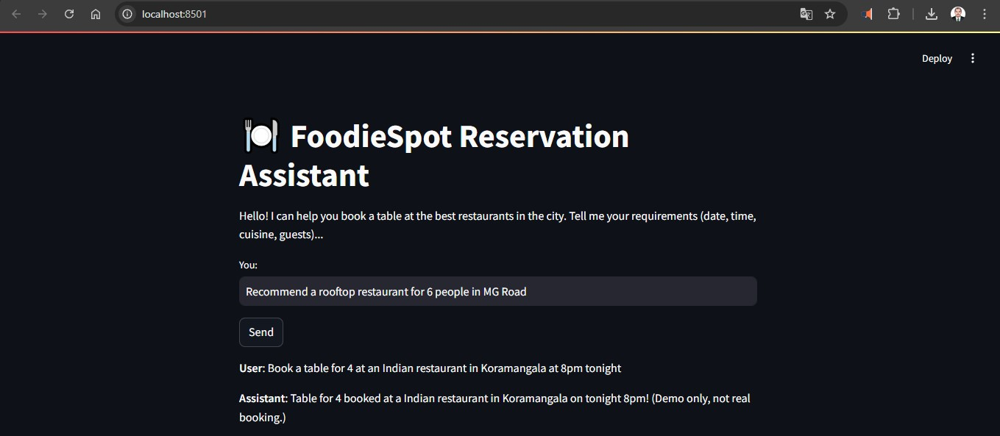
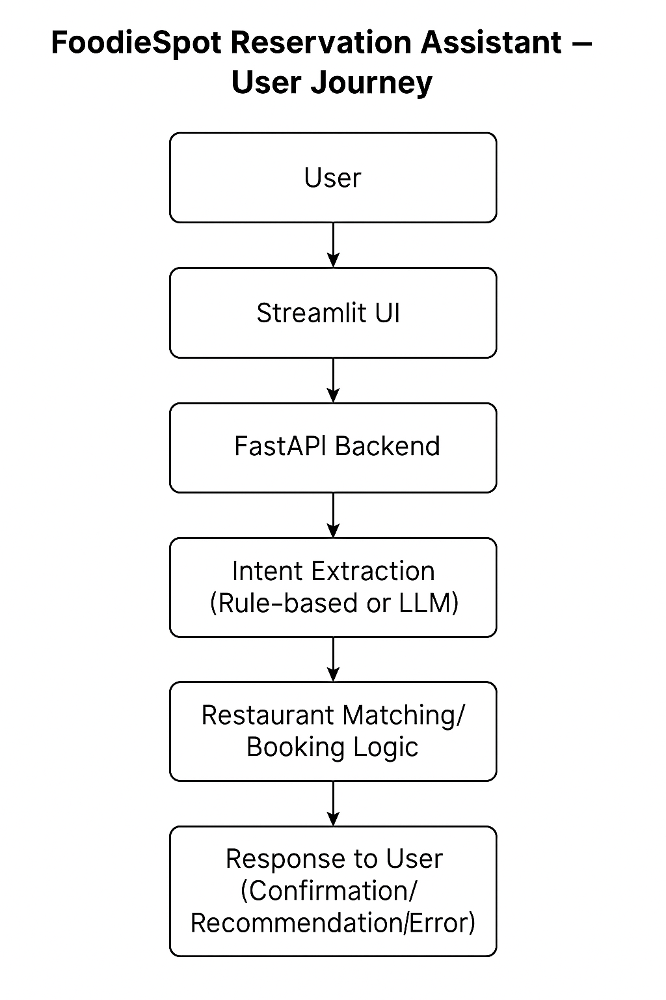

# FoodieSpot AI Reservation Agent

**Developer:** Waseem Ibn Yousef CM ([GitHub](https://github.com/cmwaseemyousef))

---

## Overview

Conversational AI agent to book restaurant reservations, recommend venues, and answer guest queries using LLM-powered intent understanding.

- 20+ restaurants with live data (see `restaurants.json`)
- Natural language chat via Streamlit UI
- Tool-calling architecture (no LangChain or 3rd-party agents)
- Designed for real-world business impact

---

## Features

- Book/cancel/modify reservations (demo, no real booking)
- Venue recommendations based on cuisine, location, guests, etc.
- Handles various user intents, errors, and edge cases

---

## How to Run

```bash
pip install -r requirements.txt
uvicorn backend:app --reload
streamlit run app.py
```

---

## Architecture

- **Frontend:** Streamlit chat app (see `app.py`)
- **Backend:** FastAPI server with `/agent` endpoint (see `backend.py`)
- **LLM Tool-Calling:** Backend calls a function to extract user intent and parameters

---

## LLM Intent Extraction: Rule-Based Mock (Demo Only)

> ⚠️ **Note:** Due to lack of access to a free public LLM API, this backend uses a simple rule-based function (`call_llm()`) to simulate intent extraction from user queries.  
> The architecture and API contract fully support replacing this with any real LLM (OpenAI, Hugging Face, Ollama, etc.) in the future by updating the `call_llm()` function.

- To enable real LLM integration, simply replace the rule-based function with an API call to your preferred LLM endpoint.
- This choice ensures the frontend and tool-calling architecture work exactly as expected for the assignment demo.

---

## Example Conversations

User: Book a table for 4 at an Indian restaurant in Koramangala at 8pm tonight.
Assistant: Table for 4 booked at a Indian restaurant in Koramangala on tonight 8pm! (Demo only, not real booking.)

User: Show me Chinese restaurants in MG Road.
Assistant: Here are some Chinese restaurants in MG Road: Noodle Street

User: Recommend a rooftop restaurant for 6 people in MG Road.
Assistant: Here are some rooftop restaurants in MG Road: FoodieSpot Central

User: Book a table for 100 at a seafood restaurant in Marathahalli.
Assistant: Sorry, no matching restaurants found.

User: Cancel my booking for today.
Assistant: Sorry, I can only help with searching and booking right now. (Demo limitation)

---

## UI Screenshot



## User Journey



---

## File Tree

.
├── app.py
├── backend.py
├── restaurants.json
├── requirements.txt
├── README.md
├── business_strategy.md
├── prompt_examples.md
├── assumptions.md
└── images/
    ├── ui-screenshot.png
    └── user-journey.png

---

## Supporting Docs

Business Strategy
Prompt Examples
Assumptions & Roadmap

---

## LLM API Integration
To switch to a real LLM, replace the call_llm() function in backend.py with your API integration (see comments in the code).

---

## Prompt Engineering Approach

- System prompt instructs LLM to extract intent and booking details as JSON.
- Conversation history is passed as chat format.
- Tool-calling architecture lets the backend process the extracted info and reply with real data.

---

## Assumptions & Limitations

- This demo uses a rule-based mock in place of an LLM for intent extraction.
- No real payment or reservation is made—this is a prototype/demo only.
- LLM integration is one function swap away; ready for use with Hugging Face, OpenAI, or any other compatible endpoint.

---

## Future Enhancements

- Integrate a production LLM for real intent extraction and reasoning.
- Support more advanced booking flows (modify/cancel).
- Add real-time table availability, notifications, and multi-turn dialogs.

---

## Contact

[Waseem Ibn Yousef CM](https://github.com/cmwaseemyousef)


